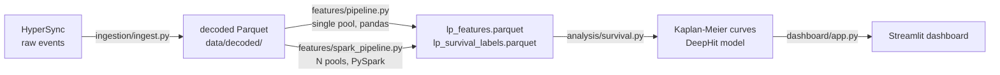

# LPulse — LP Retention Analysis Pipeline

> **Research question:** Are liquidity providers on Uniswap V3 incentive campaigns genuine market makers, or mercenary yield-farmers who leave the moment rewards dry up?

LPulse ingests on-chain events (Mint, Burn, Swap, Collect) for Uniswap V3 pools, reconstructs individual LP position lifecycles, and feeds a survival analysis model to test that hypothesis.

---

## Architecture



Two feature pipelines, same output schema:
- `pipeline.py` — pure pandas, single pool, runs in seconds locally
- `spark_pipeline.py` — PySpark, designed for fan-out across N pools on Dataproc

---

## Quickstart (local)

```bash
# 1. Decode raw HyperSync events
python -m ingestion.ingest \
  --chain celo \
  --pool 0xF55791AfBB35aD42984f18D6Fe3e1fF73D81900c

# 2a. Run pandas pipeline (fast, single pool)
python -m features.pipeline \
  --chain celo \
  --pool 0xF55791AfBB35aD42984f18D6Fe3e1fF73D81900c \
  --merkl-url "https://app.merkl.xyz/opportunities/celo/CLAMM/0xF55791..." \
  --source parquet

# 2b. Run Spark pipeline (local[*] mode)
python -m features.spark_pipeline \
  --chain celo \
  --pool 0xF55791AfBB35aD42984f18D6Fe3e1fF73D81900c \
  --merkl-url "https://app.merkl.xyz/opportunities/celo/CLAMM/0xF55791..." \
  [--skew-threshold 1000]   # lower = more keys routed to pandas fallback
```

Requires: Python 3.11+, Java 11+, `pip install -r requirements.txt`.

---

## Spark pipeline — design & decisions

### Why Spark?

The feature computation per pool is fixed and modest (~100k positions, 2M swaps). The scale is in the **number of pools**: dozens of Celo pools, hundreds across chains. Spark's value is scheduling, not computation — one task per pool, N pools in parallel across Dataproc workers.

```
Dataproc cluster
  ├── worker 1 → pool A  ──┐
  ├── worker 2 → pool B    ├── same logic, isolated JVMs, no shared state
  └── worker 3 → pool C  ──┘
```

The computation logic lives in `features/metrics.py` (pure pandas, independently testable). Spark wraps it.

### Key Spark concepts used

**Window functions** — LP position cycles are reconstructed via a cumulative sum over events ordered by `(block_number, tx_index, log_index)`, partitioned by `(owner, tick_lower, tick_upper)`. This is stateful ordered aggregation: all events for one position land in one partition by design.

**Data skew / hot-normal split** — One whale address held 16 tick-range keys with 1,000–3,700 events each. At 4g heap, the corresponding partition spilled 928 MB memory + 141 MB disk and hung for >1 hour. Fix: compute per-key event counts, route keys above a threshold to a pandas fallback on the driver, union results. `--skew-threshold` is a CLI parameter for benchmarking.

**Benchmark (stable pool, 8g heap):**

| Config | `verify_lp_exit` stage |
|---|---|
| Skew split disabled (threshold=999999) | 7.6s |
| Skew split enabled (threshold=1000) | 17.3s |

The split is load-bearing at 4g (eliminates the stall); redundant at 8g (overhead exceeds savings). Fix 2 (memory config) is the load-bearing fix.

**ASOF join — the root cause bug** — Classifying exits requires finding the last swap before each LP exit. The naive Spark translation joins positions × swaps on `pool_address`, then filters by `swap_ts <= exit_timestamp`. Since `pool_address` is the same for all rows on both sides, Spark materialises a cartesian product — 100k × 1.7M = 170 billion intermediate rows. This exhausts any heap size; it is an algorithmic complexity problem, not a tuning problem.

Fix: `_exit_type_spark` delegates to `pd.merge_asof` (sorted pointer-walk, O(N log N)), already implemented and tested in `features/metrics.py`. Local-mode only — see GCP roadmap below.

**Unified Memory Manager (local[*])** — In `local[*]` mode all executor threads share one JVM and one Tungsten memory pool. When earlier tasks in a stage exhaust the pool, remaining tasks enter `RUNNING` but never execute (`executorDeserializeTime = 0` indefinitely). This is a lock-contention deadlock, not GC. It cannot occur on a cluster where each worker node has its own isolated JVM.

---

## Research results

Two CELO pools processed end-to-end:

| Pool | Type | Positions | range_exit | voluntary_exit | Median duration |
|---|---|---|---|---|---|
| `0xF55791...` | WETH/USDT (volatile) | 107,301 | **92.6%** | 7.4% | ~0h |
| `0x1a810...` | cUSD/USDC (stable) | 14,474 | 51.3% | 48.5% | 2.0h |

The volatile pool shows a near-pure mercenary signature: 99.8% of positions opened during campaigns, 92.6% ended as range_exit (price drifted, LP never came back). The stable pool shows a genuine split — tighter price range keeps positions in-range longer, and 15.7% of LPs were active before any campaign.

---

## GCP migration roadmap

Current state runs entirely locally. Intended production stack:

```
HyperSync webhooks
  └─► Cloud Storage (raw events, Parquet)
        └─► Cloud Dataflow (decode job — decode_events.py as Apache Beam transform)
              └─► GCS decoded/
                    └─► Dataproc (PySpark, spark_pipeline.py)
                          one Spark task per pool, submitted via Dataproc Jobs API
                          └─► GCS features/
                                └─► BigQuery (lp_features, lp_survival_labels)
                                      └─► Vertex AI (DeepHit training job)
                                            └─► Looker Studio / dashboard
```

**Spark changes needed for Dataproc:**
1. Replace `_exit_type_spark` pandas bridge with a native range-join (Spark 3.3+ `spark.sql.optimizer.rangeJoin.enabled`, or bucketed sort-merge by time bucket). At multi-pool scale each executor handles one pool — 1.7M swaps × 100 bytes ≈ 170 MB/executor, fits in RAM.
2. Remove `coalesce(1)` in output writes — let Spark write partitioned Parquet to GCS.
3. Pool list driven by a BigQuery table or GCS manifest rather than CLI arg.
4. `--master` becomes a Dataproc cluster URL (`yarn` or `spark://...`).

Core logic in `metrics.py` is unchanged — it is already stateless and Dataproc-portable.

---

## Repository map

```
features/
  metrics.py           — pure pandas: verify_lp_exit, exit_type, event_sequence
  pipeline.py          — single-pool pandas runner
  spark_pipeline.py    — PySpark runner (local + Dataproc)
  merkl.py             — campaign window fetcher (Merkl API)

ingestion/
  ingest.py            — CLI: fetch + decode one pool
  hypersync_client.py  — HyperSync REST client
  decode_events.py     — ABI decoder → typed Parquet
  pools_registry.yaml  — pool + Merkl URL registry

analysis/
  survival.py          — Kaplan-Meier + DeepHit wrappers
  plots.py             — matplotlib / plotly charts

dashboard/
  app.py               — Streamlit app

spark_iteration_summary.md   — full technical postmortem
spark_interview_prep.md      — Spark concepts + interview Q&A
spark_monitor.ps1            — PowerShell Spark REST API health monitor
```
